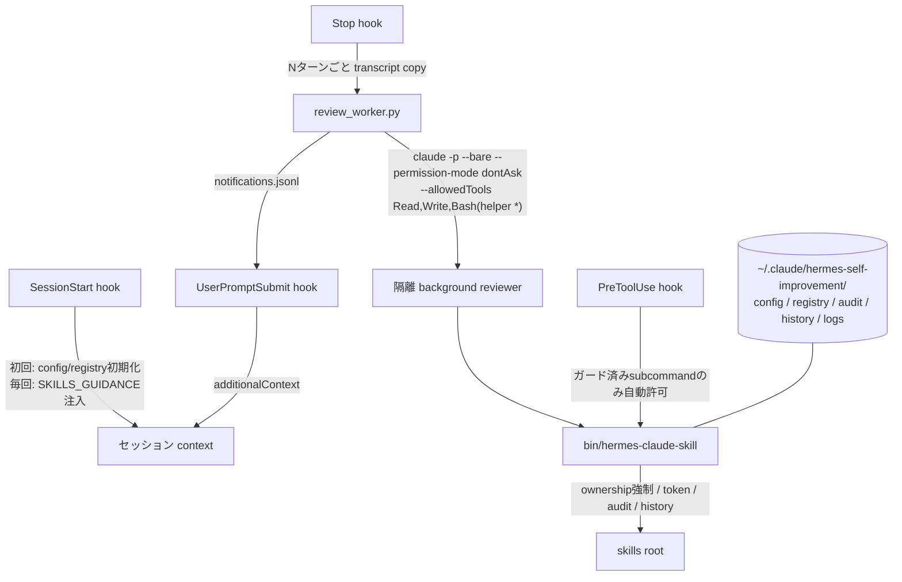
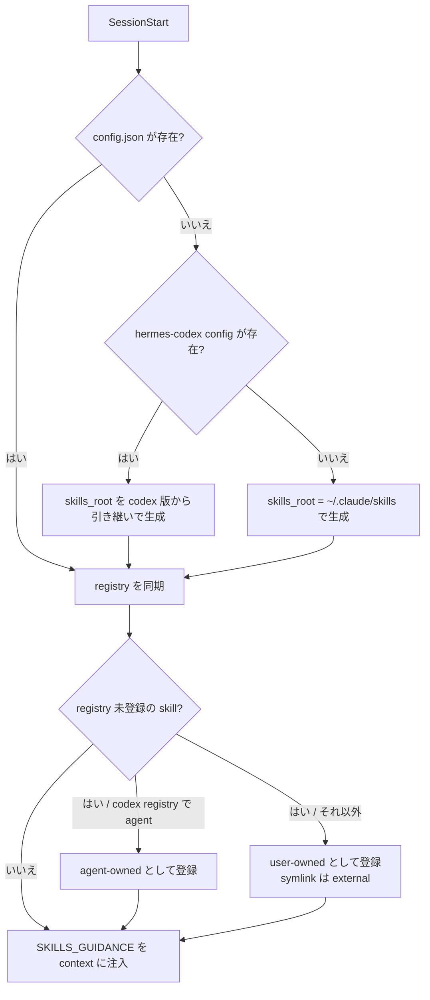
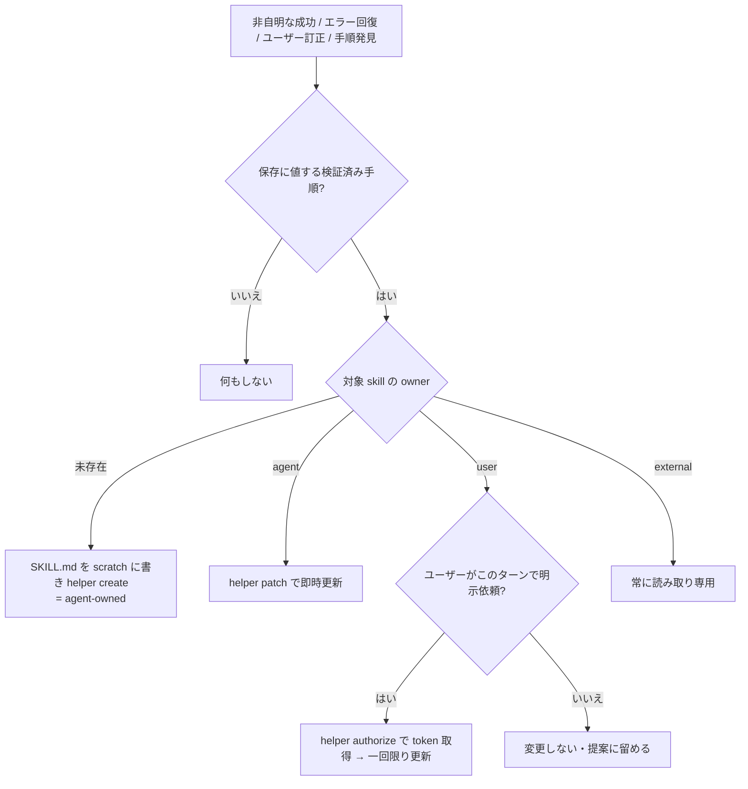
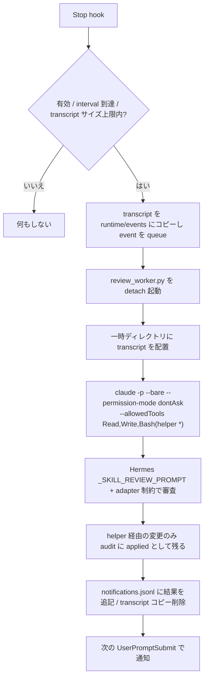
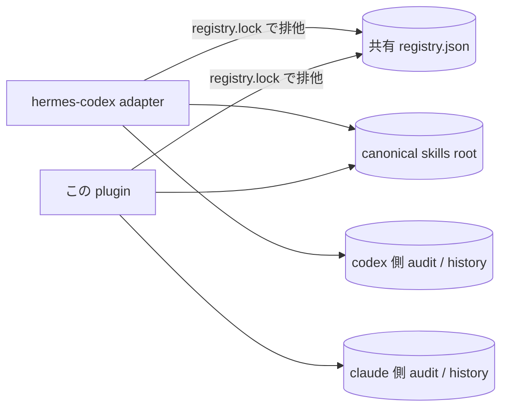

# Hermes Self-Improvement Claude Plugin

A Claude Code plugin that ports the skill self-improvement loop of the [Hermes Agent](https://github.com/NousResearch/hermes-agent): Claude learns reusable skills from its own work in the foreground, and an isolated `claude -p` background reviewer catches missed learnings every N turns — all writes gated by an ownership-enforcing helper (agent/user/external, one-time authorization tokens, audit log). Claude Code port of [hermes-self-improvement-codex-adapter](https://github.com/lilpacy/hermes-self-improvement-codex-adapter); when that adapter is installed, both share one canonical skills root and one ownership registry.

```text
/plugin marketplace add lilpacy/hermes-self-improvement-claude-plugin
/plugin install hermes-self-improvement@lilpacy
```

Documentation below is in Japanese.

---

[Hermes Agent](https://github.com/NousResearch/hermes-agent) の Skill 自己改善ループを Claude Code に移植した Claude Code plugin。[hermes-self-improvement-codex-adapter](https://github.com/lilpacy/hermes-self-improvement-codex-adapter) の Claude Code 版であり、同一マシンに codex adapter が導入済みの場合は canonical skills root と ownership registry を共有し、両者を併用しても所有権が一貫します。

Hermes の memory / user modeling / session search は移植対象外。Skill の自己改善ループのみを、上流プロンプト(`SKILLS_GUIDANCE` / `_SKILL_REVIEW_PROMPT`)を AST 抽出でそのまま用いて忠実に再現します。

## 1. 実現する挙動

| ループ | 契機 | 仕組み |
|---|---|---|
| フォアグラウンド学習 | 会話中の学び(非自明なタスク完了、エラー回復、ユーザー訂正、再利用可能な手順の発見) | `SessionStart` hook が毎セッション Hermes の `SKILLS_GUIDANCE` と adapter ポリシーを context に注入し、Claude 自身がガード付き helper 経由で agent-owned skill を即時作成・patch |
| バックグラウンド学習 | N ターン完了ごと(デフォルト 10) | `Stop` hook が transcript をコピーし、隔離された `claude -p --bare` プロセスに Hermes の `_SKILL_REVIEW_PROMPT` を実行させて取りこぼしを回収。結果は次の `UserPromptSubmit` で通知 |

### アーキテクチャ



### 所有権デシジョンテーブル

| 条件 \ ケース | 1 | 2 | 3 | 4 | 5 |
|---|---|---|---|---|---|
| skill が symlink である | Y | N | N | N | N |
| helper `create` で作成された | - | Y | N | N | N |
| 共有 registry で `agent` | - | - | Y | N | N |
| 有効な authorization token を提示 | - | - | - | Y | N |
| **owner 判定** | external | agent | agent | user | user |
| **自律 create/patch/edit/delete を許可する** | - | X | X | X(一回限り) | - |

凡例: 条件 `Y` = 真、`N` = 偽、`-` = 無関係。動作 `X` = 実行する、`-` = 拒否。

- user-owned skill の変更は、ユーザーがそのターンで明示依頼した場合のみ `authorize` の一回限り token(skill・action 限定、TTL 30〜3600 秒・デフォルト 600 秒)経由で可能。
- `adopt` / `release` で ownership を user ⇄ agent に移動(明示依頼時のみ)。
- background reviewer は `authorize` / `adopt` / `release` / `create-user` を一切実行できない(helper 内で強制)。
- external(symlink)skill は常に読み取り専用で、adopt もできない。

## 2. 配置

### リポジトリ構成

| パス | 内容 |
|---|---|
| `.claude-plugin/plugin.json` | plugin manifest |
| `.claude-plugin/marketplace.json` | この repo 自体を marketplace として追加するための定義 |
| `hooks/hooks.json` | 4 hook の登録(plugin 機構が自動で読み込む) |
| `hooks/session_start.py` | 初回初期化 + ガイダンス注入 |
| `hooks/stop.py` | ターン数計数と background review の起動 |
| `hooks/user_prompt_submit.py` | background review 結果の通知 |
| `hooks/pre_tool_use.py` | ガード済み helper コマンドの自動許可 |
| `scripts/skill_manager.py` | ownership 強制・token・audit・history を担う中核 |
| `scripts/review_worker.py` | 隔離 background review の実行 |
| `scripts/review_cli.py` | review の status/run/logs/config/upstream-update |
| `scripts/vendor_prompts.py` | Hermes 上流プロンプトの AST 抽出(メンテナ用) |
| `bin/hermes-claude-skill` / `bin/hermes-claude-review` | CLI wrapper(plugin の `bin/` は Claude Code の Bash セッションで PATH に入る) |
| `vendor/hermes/` | 抽出済み上流プロンプト + `UPSTREAM.json`(pinned commit + SHA-256)+ 上流 LICENSE |
| `prompts/*.fallback.txt` | vendor が無い場合のオフライン fallback(Hermes 本文は含まない) |
| `tests/smoke-test.sh` | fake claude による一括検証 |

### 実行時に作られるパス

| パス | 内容 |
|---|---|
| skills root(後述) | skill 本体。既存 = user-owned、自動作成 = agent-owned、symlink = external |
| `~/.claude/hermes-self-improvement/config.json` | 設定 |
| registry(後述の決定表参照) | ownership registry と authorization token(hash 保存)。codex adapter 同居時は codex 側と同一ファイルを共有 |
| `~/.claude/hermes-self-improvement/audit.jsonl` | 全操作の監査ログ(applied / denied / issued / read) |
| `~/.claude/hermes-self-improvement/history/<skill>/<stamp>-<action>/` | 変更前の skill 全体のバックアップ |
| `~/.claude/hermes-self-improvement/runtime/` | ターンカウンタ、queued event、review の実行ログ |
| `~/.claude/hermes-self-improvement/notifications.jsonl` | 未配送の background review 結果 |

データ root は環境変数 `HERMES_CLAUDE_DATA_DIR` で変更できます。plugin のアンインストールと独立に残るため、監査履歴と ownership は plugin を入れ直しても失われません。

### skills root と registry の決定

| 条件 \ ケース | 1 | 2 |
|---|---|---|
| 初回起動時に `~/.config/hermes-codex/config.json` が存在し `skills_root` を持つ | Y | N |
| **skills root** | codex adapter と同じ canonical dir | `~/.claude/skills` |
| **registry** | codex adapter の `<state_root>/registry.json` を共有 | `~/.claude/hermes-self-improvement/registry.json` |

codex adapter と同居する場合、両 adapter は同一の skill ディレクトリ群と単一の ownership registry を共同管理します(§15)。排他は registry と同じディレクトリの `registry.lock` で行い、両 adapter が同一ロックを取り合います。

## 3. 前提条件

- macOS / Linux / WSL2(ネイティブ Windows は未検証)
- `claude`(Claude Code CLI)と `python3` が PATH にあること
- background review は `claude -p`(ヘッドレス)を起動するため、通常の Claude Code と同じ認証・利用枠を消費します

## 4. インストール

### 4.1 GitHub から

```text
/plugin marketplace add lilpacy/hermes-self-improvement-claude-plugin
/plugin install hermes-self-improvement@lilpacy
```

### 4.2 ローカル開発

```bash
git clone git@github.com:lilpacy/hermes-self-improvement-claude-plugin.git
claude --plugin-dir /path/to/hermes-self-improvement-claude-plugin
```

`--plugin-dir` は同名のインストール済み plugin より優先されるため、開発中の検証に使えます。

### 4.3 インストール後に起きること

install script はありません。初回セッション開始時に `SessionStart` hook が次を行います。



## 5. Hook の確認

plugin の hook は `hooks/hooks.json` から自動登録されます。`/hooks` で次の 4 つが plugin 由来として見えることを確認してください。

| event | 役割 | timeout |
|---|---|---|
| `SessionStart` | 初期化 + ガイダンス注入 | 15s |
| `Stop` | ターン計数、N ターンごとに review 起動(非同期・detach) | 5s |
| `UserPromptSubmit` | 未配送の review 結果を `additionalContext` で注入 | 3s |
| `PreToolUse` (Bash) | ガード済み helper subcommand のみ `permissionDecision: allow` | 5s |

## 6. 導入確認

```bash
# helper の自己診断(claude 実行ファイル、config、registry、vendor prompt などを検査)
~/.claude/plugins/cache/<marketplace>/hermes-self-improvement/<version>/bin/hermes-claude-skill doctor

# review 設定と upstream pin の確認
bin/hermes-claude-review status
```

Claude Code のセッション内なら plugin の `bin/` が PATH に入るため、`hermes-claude-skill doctor` で直接呼べます。新しいセッションを開始し、context に `## Hermes-compatible skill self-improvement` が注入されていることも確認してください。

## 7. 通常会話中の自己改善(foreground)

Claude は注入されたガイダンスに従い、学びが確定したターンの終わりに自律で skill を保存・更新します。



`PreToolUse` hook により、read 系とガード済み書き込み(`list` / `view` / `create` / `patch` / `edit` / `write-file` / `remove-file` / `delete` / `owner` / `audit` / `doctor` / `status` / `logs` / `config`)は許可プロンプトなしで実行されます。ownership を変える `authorize` / `adopt` / `release` / `create-user` は通常の許可フローに残るため、ユーザーが目視で承認することになります。シェル結合(`;` `|` `&` など)を含むコマンドは自動許可しません。

## 8. Background review



隔離の内訳:

- `--bare`: hooks / plugins / MCP を読み込まないため、reviewer 自身の Stop hook 再帰が構造的に発生しない(`HERMES_CLAUDE_BACKGROUND=1` ガードも保険で残置)
- `--permission-mode dontAsk` + `--allowedTools`: 許可プロンプトを出さず、道具を `Read` / `Write` / helper の `Bash` に制限
- `HERMES_CLAUDE_ACTOR=background`: helper が ownership 変更系コマンドを一律拒否
- 実行ディレクトリは一時ディレクトリで、元の作業リポジトリには「context としてのみ扱い、アクセスするな」とプロンプトで明示
- 同時実行は lock で 1 本に制限、timeout(デフォルト 900 秒)で強制終了

## 9. Skill 管理コマンド

以下、`hermes-claude-skill` は plugin の `bin/hermes-claude-skill`(セッション内なら PATH 済み)。

### 一覧・参照

```bash
hermes-claude-skill list            # NAME/OWNER/PROTECTED/EXISTS/PATCHES
hermes-claude-skill list --json
hermes-claude-skill view <name>                 # SKILL.md を表示
hermes-claude-skill view <name> --file <rel>    # 付属ファイルを表示
hermes-claude-skill owner <name>                # registry record を表示
```

### agent-owned skill(自律運用)

```bash
# 作成: 完全な SKILL.md を scratch に書いてから
hermes-claude-skill create <name> --content-file /tmp/skill.md

# 更新: 完全一致・単一出現の old/new 置換(推奨)
hermes-claude-skill patch <name> --old-file /tmp/old.txt --new-file /tmp/new.txt

# 全置換 / 付属ファイル / 削除
hermes-claude-skill edit <name> --content-file /tmp/skill.md
hermes-claude-skill write-file <name> references/notes.md --file /tmp/notes.md
hermes-claude-skill remove-file <name> references/notes.md
hermes-claude-skill delete <name>   # history へ退避してから削除
```

`create` / `edit` / `patch` は frontmatter(`name` が dir 名と一致・`description` 必須)、サイズ上限、行数上限、secret パターン(AWS key・private key・GitHub token 等)を検証し、失敗した変更は原子的にロールバックされます。

### user-owned skill を一回だけ更新(明示依頼時のみ)

```bash
TOKEN=$(hermes-claude-skill authorize <name> --actions patch)   # stderr に USER APPROVAL REQUIRED 警告
hermes-claude-skill patch <name> --old-file old.txt --new-file new.txt --authorization "$TOKEN"
```

token は skill・action 限定、一回限り、TTL デフォルト 600 秒(`--ttl 30..3600`)。background actor は発行も使用もできません。

### 所有権移管(明示依頼時のみ)

```bash
hermes-claude-skill adopt <name>     # user → agent(以後自律更新を許可)
hermes-claude-skill release <name>   # agent → user(以後自律更新を拒否)
hermes-claude-skill create-user <name> --content-file /tmp/skill.md   # 最初から user-owned で作成
```

## 10. Background 設定

```bash
hermes-claude-review status
hermes-claude-review config --interval 5          # N ターンごと(0 で無効)
hermes-claude-review config --model haiku         # reviewer のモデル
hermes-claude-review config --timeout 600
hermes-claude-review config --disable / --enable
hermes-claude-review logs --tail 10
hermes-claude-review run --transcript <path>      # 手動で 1 回実行
```

`~/.claude/hermes-self-improvement/config.json` の全キー:

| キー | デフォルト | 意味 |
|---|---|---|
| `skills_root` | `~/.claude/skills`(codex 同居時は codex の canonical dir) | skill 本体の置き場所 |
| `registry_path` | `""`(codex 同居時は codex の registry.json) | ownership registry の場所。空なら `~/.claude/hermes-self-improvement/registry.json` |
| `import_owner_registries` | `["~/.local/state/hermes-codex/registry.json"]` | registry を共有**しない**構成でのみ有効な、新規登録時の owner 引き継ぎ元 |
| `background_review.enabled` | `true` | background review の有効 / 無効 |
| `background_review.interval_turns` | `10` | 起動間隔(ターン)。境界: `count % interval == 0` の Stop で起動 |
| `background_review.timeout_seconds` | `900` | reviewer の強制終了(下限 30) |
| `background_review.model` | `""`(セッション既定) | reviewer のモデル |
| `background_review.max_transcript_bytes` | `26214400`(25MiB) | これを超える transcript は審査しない(上限を含まない) |
| `background_review.delete_transcript_copy` | `true` | 審査後に transcript コピーを削除 |
| `validation.max_file_bytes` | `262144`(256KiB) | skill 内 1 ファイルの上限(上限を含まない) |
| `validation.max_skill_lines` | `500` | SKILL.md の行数上限(上限を含む) |

## 11. 動作テスト

### 11.1 実装 smoke test

```bash
tests/smoke-test.sh
```

fake `claude` を PATH に置き、次を一括検証します: SessionStart 初期化とガイダンス注入 / codex config からの skills_root 引き継ぎ / codex registry からの agent ownership 引き継ぎ / agent-owned の自律 create・patch / user-owned の自律変更拒否 / authorize token での一回限り更新 / background actor の authorize 拒否 / PreToolUse の自動許可と非許可 / Stop → background review → UserPromptSubmit 通知の全経路 / 背景ガード下の hook no-op。

### 11.2 実 Claude Code で foreground test

新しいセッションで「この手順を skill として保存して」等を依頼し、`hermes-claude-skill list` に agent-owned で現れること、既存 skill への自律変更が拒否されることを確認します。

### 11.3 Background test

```bash
hermes-claude-review config --interval 1
# 何か 1 ターン会話して終了を待つ
hermes-claude-review logs --tail 1   # 実行ログの確認
# 次のプロンプト送信時に「Background skill review applied: ...」が注入される
hermes-claude-review config --interval 10
```

## 12. 履歴・監査

```bash
hermes-claude-skill audit --tail 20        # applied / denied / issued / read の JSONL
ls ~/.claude/hermes-self-improvement/history/<skill>/   # 変更前スナップショット
```

audit イベントは actor(foreground / background / manual)、action、owner、変更前後の tree hash、cwd を含みます。denied イベント(保護 skill への自律変更の試み等)もすべて記録されます。

## 13. Hermes upstream 更新

vendored prompt は commit pin 済み(`vendor/hermes/UPSTREAM.json`)。更新はこのリポジトリの clone 上で行い、commit して配布します。

```bash
bin/hermes-claude-review upstream-update <commit-sha>   # 旧 vendor は state に backup
git diff vendor/hermes/ && git commit
```

インストール済み plugin の cache 内で直接実行した場合、plugin 更新時に上書きされる点に注意してください。

## 14. アンインストール

```text
/plugin uninstall hermes-self-improvement@lilpacy
```

- skill 本体(skills root)には一切触れません
- ownership registry・audit・history(`~/.claude/hermes-self-improvement/`)は plugin と独立に残ります。完全に消す場合: `rm -rf ~/.claude/hermes-self-improvement`
- codex 版と異なり hook は plugin 機構ごと外れるため、no-op stub や `--finalize` 手順は不要です

## 15. hermes-codex adapter との共存

両 adapter を併用する前提の設計です。同一マシンに codex adapter が導入済みの場合:



| 項目 | 挙動 |
|---|---|
| skills root | 初回起動時に codex config の `skills_root` を引き継ぎ、両 adapter が同一の canonical dir を管理 |
| ownership registry | **単一ファイルを共有**(初回起動時に codex の `<state_root>/registry.json` を `registry_path` に設定)。フォーマットは完全互換 |
| ownership(双方向) | どちらの adapter で create / adopt / release しても、もう一方から即座に同じ owner として見える |
| authorization token | registry 内で共有される。どちらの adapter で発行しても有効(一回限り・TTL・skill/action 限定は共通) |
| 排他制御 | registry と同じディレクトリの `registry.lock`(O_EXCL)を両 adapter が取り合う |
| audit / history / 通知 | それぞれ独立(claude: `~/.claude/hermes-self-improvement/`、codex: `~/.local/state/hermes-codex/`) |
| `import_owner_registries` | registry を共有しない構成(codex config が無い等)でのみ働く fallback。共有時は登録済み record が常に優先され、実質 no-op |

### Claude Code からの skill 可視性

Claude Code が skill として読み込むのは `~/.claude/skills` / project `.claude/skills` / plugin 同梱分のみです。skills root が canonical dir(例: `~/dotfiles/skills`)の場合、そこに自動作成された skill は **symlink を張るまで Claude Code のセッションには現れません**(dotfiles の `link-skills.sh` のような同期スクリプトの運用に従います)。skill の管理・学習と、どのエージェントにどの skill を見せるかの curation は独立している、という設計です。

## 16. 重要な制約

- Hermes の memory / curator / archive 機能は移植していません
- project-local `.claude/skills` は対象外(チーム管理の skill を自律変更しないため)
- transcript は不安定なフォーマットとして扱い、パースせず生のまま reviewer に渡します
- background reviewer は通常の Claude Code と同じ認証・利用枠を消費します(モデルは `config --model` で軽量化可能)
- reviewer の `Write` は一時ディレクトリでの scratch ファイル作成を想定していますが、パス単位では拘束していません(最終防衛線は helper 側の enforcement)
- registry を codex 側と共有している場合、codex adapter を `--purge-state` 付きでアンインストールすると共有 registry ごと消えます。その後の再登録では全 skill が user-owned 扱いに戻るため、必要なら registry を backup してください
- helper を迂回した直接ファイル書き込みの禁止は、フォアグラウンドでは Claude Code の通常の permission フロー、それを通過した後は advisory です

## 17. 保護の強度

| レイヤ | 内容 | 強制力 |
|---|---|---|
| helper 内 enforcement | ownership 検査、一回限り token 検証、background actor 制限、skill バリデーション、原子的適用とロールバック | 強制(コードで拒否) |
| 追跡 | 変更前スナップショット(history)、JSONL audit、tree hash | 事後検証可能 |
| PreToolUse 自動許可 | ガード済み subcommand のみ許可、ownership 変更系はユーザーの目視承認に残す | 強制(hook で判定) |
| ガイダンス | SessionStart 注入、`USER APPROVAL REQUIRED` stderr 警告 | 助言のみ |
| 直接書き込みの禁止 | 「helper 以外で skill を書き換えるな」 | 助言のみ |

codex 版 README と同じく、脅威モデルは「エージェントがガイダンスに協力する」ことを前提とします。skills root が git 管理下(dotfiles 等)にあれば、全自律変更は `git diff` で監査できます。

## License / Notices

`vendor/hermes/` は upstream(NousResearch/hermes-agent)のライセンスに従います。詳細は `THIRD_PARTY_NOTICES.md` と `vendor/hermes/LICENSE.hermes-agent`。
