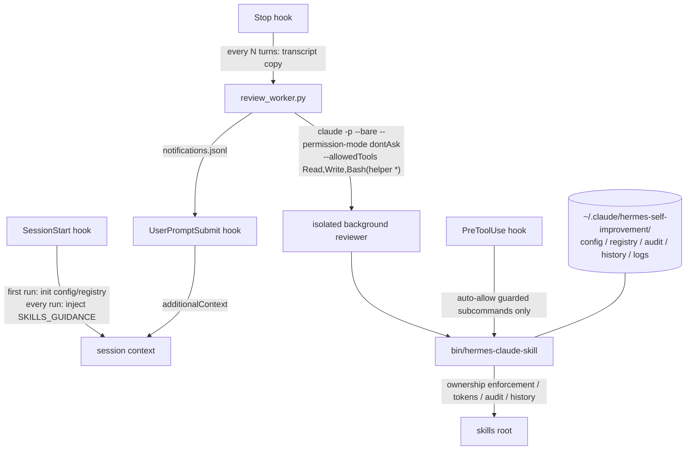
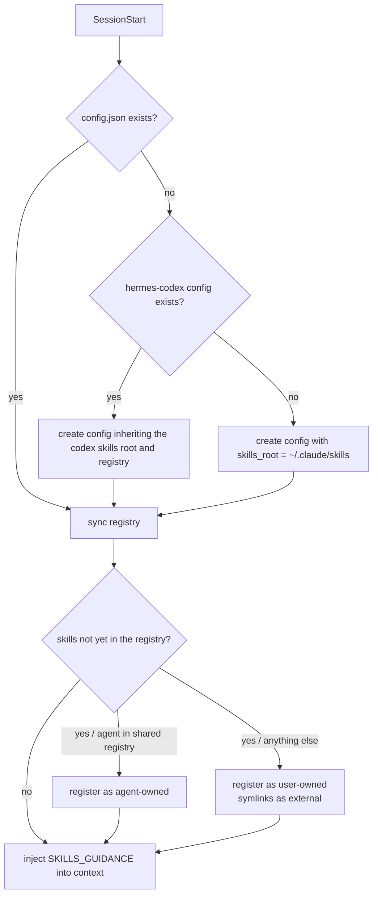
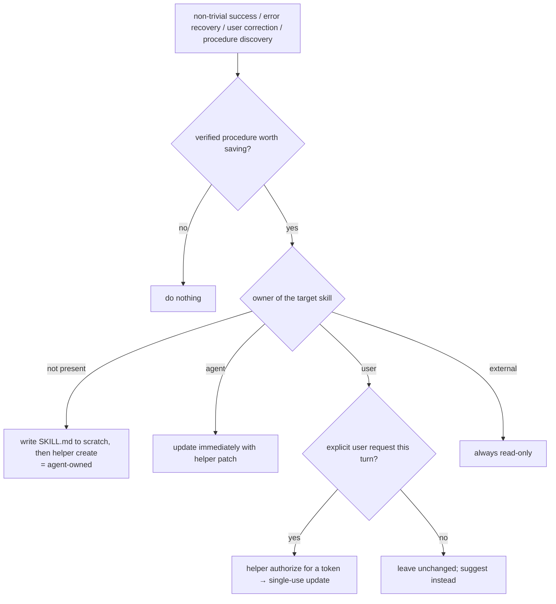
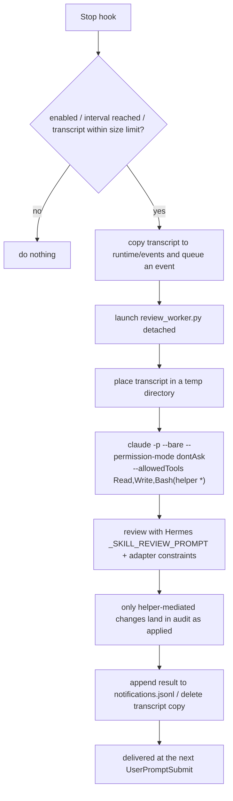
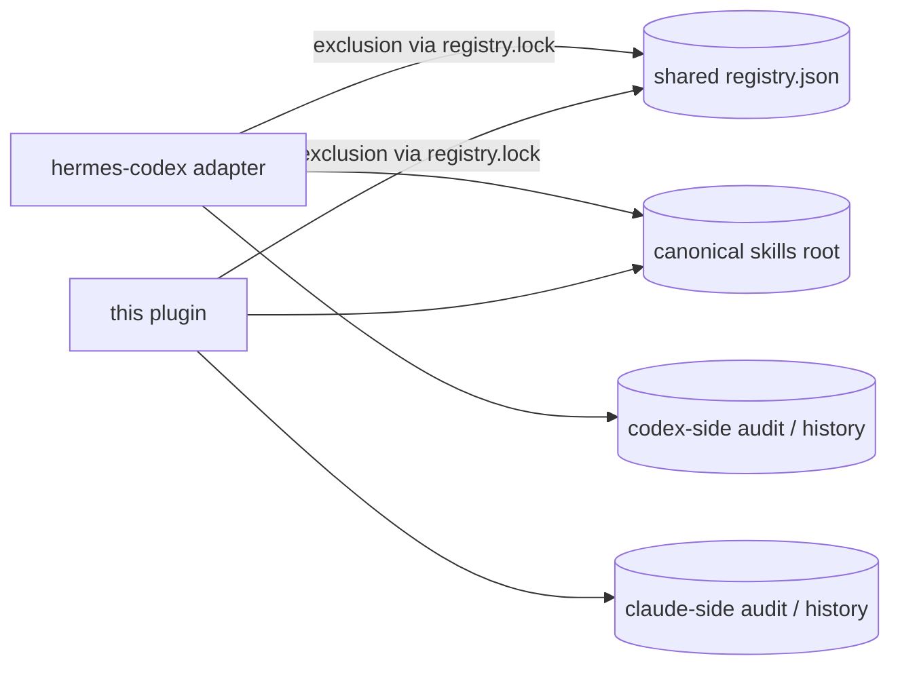

# Hermes Self-Improvement Claude Plugin

English | [日本語](README.ja.md)

A Claude Code plugin that ports the skill self-improvement loop of the [Hermes Agent](https://github.com/NousResearch/hermes-agent) to Claude Code. It is the Claude Code counterpart of [hermes-self-improvement-codex-adapter](https://github.com/lilpacy/hermes-self-improvement-codex-adapter); when that adapter is installed on the same machine, both share one canonical skills root and one ownership registry, so ownership stays consistent while using both side by side.

Hermes's memory / user modeling / session search are out of scope. Only the skill self-improvement loop is reproduced, faithfully, using the upstream prompts (`SKILLS_GUIDANCE` / `_SKILL_REVIEW_PROMPT`) extracted verbatim by AST parsing.

## 1. What it does

| Loop | Trigger | Mechanism |
|---|---|---|
| Foreground learning | Learnings during conversation (non-trivial task completion, error recovery, user correction, discovery of a reusable procedure) | A `SessionStart` hook injects Hermes's `SKILLS_GUIDANCE` and the adapter policy into context every session; Claude itself creates/patches agent-owned skills immediately through the guarded helper |
| Background learning | Every N completed turns (default 10) | A `Stop` hook copies the transcript and has an isolated `claude -p --bare` process run Hermes's `_SKILL_REVIEW_PROMPT` to catch missed learnings; results are delivered at the next `UserPromptSubmit` |

### Architecture



### Ownership decision table

| Condition \ Case | 1 | 2 | 3 | 4 | 5 |
|---|---|---|---|---|---|
| Skill is a symlink | Y | N | N | N | N |
| Created via helper `create` | - | Y | N | N | N |
| `agent` in the shared registry | - | - | Y | N | N |
| Valid authorization token presented | - | - | - | Y | N |
| **Resulting owner** | external | agent | agent | user | user |
| **Autonomous create/patch/edit/delete allowed** | - | X | X | X (single use) | - |

Legend: condition `Y` = true, `N` = false, `-` = irrelevant. Action `X` = allowed, `-` = denied.

- Changes to user-owned skills are possible only when the user explicitly requests them in the current turn, via a single-use `authorize` token (scoped to one skill and specific actions, TTL 30–3600s, default 600s).
- `adopt` / `release` move ownership between user ⇄ agent (explicit request only).
- The background reviewer can never run `authorize` / `adopt` / `release` / `create-user` (enforced inside the helper).
- External (symlinked) skills are always read-only and cannot be adopted.

## 2. Layout

### Repository layout

| Path | Contents |
|---|---|
| `.claude-plugin/plugin.json` | Plugin manifest |
| `.claude-plugin/marketplace.json` | Marketplace definition so this repo itself can be added as a marketplace |
| `hooks/hooks.json` | Registration of the four hooks (loaded automatically by the plugin system) |
| `hooks/session_start.py` | First-run initialization + guidance injection |
| `hooks/stop.py` | Turn counting and background-review launch |
| `hooks/user_prompt_submit.py` | Delivery of background-review results |
| `hooks/pre_tool_use.py` | Auto-allow for guarded helper commands |
| `scripts/skill_manager.py` | The core enforcing ownership, tokens, audit, and history |
| `scripts/review_worker.py` | Isolated background review execution |
| `scripts/review_cli.py` | Review status/run/logs/config/upstream-update |
| `scripts/vendor_prompts.py` | AST extraction of upstream Hermes prompts (maintainer tool) |
| `bin/hermes-claude-skill` / `bin/hermes-claude-review` | CLI wrappers (a plugin's `bin/` is added to PATH in Claude Code Bash sessions) |
| `vendor/hermes/` | Extracted upstream prompts + `UPSTREAM.json` (pinned commit + SHA-256) + upstream LICENSE |
| `prompts/*.fallback.txt` | Offline fallbacks used when vendor files are absent (contain no Hermes text) |
| `tests/smoke-test.sh` | End-to-end verification against a fake claude |

### Paths created at runtime

| Path | Contents |
|---|---|
| skills root (see below) | The skills themselves. Pre-existing = user-owned, auto-created = agent-owned, symlinked = external |
| `~/.claude/hermes-self-improvement/config.json` | Configuration |
| registry (see decision table below) | Ownership registry and authorization tokens (stored hashed). Shared with the codex adapter when it coexists |
| `~/.claude/hermes-self-improvement/audit.jsonl` | Audit log of all operations (applied / denied / issued / read) |
| `~/.claude/hermes-self-improvement/history/<skill>/<stamp>-<action>/` | Full pre-change snapshots of each skill |
| `~/.claude/hermes-self-improvement/runtime/` | Turn counters, queued events, review execution logs |
| `~/.claude/hermes-self-improvement/notifications.jsonl` | Undelivered background-review results |

The data root can be moved with the `HERMES_CLAUDE_DATA_DIR` environment variable. It survives plugin uninstalls, so audit history and ownership are not lost across reinstalls.

### How skills root and registry are decided

| Condition \ Case | 1 | 2 |
|---|---|---|
| `~/.config/hermes-codex/config.json` exists with `skills_root` at first run | Y | N |
| **skills root** | Same canonical dir as the codex adapter | `~/.claude/skills` |
| **registry** | Shares the codex adapter's `<state_root>/registry.json` | `~/.claude/hermes-self-improvement/registry.json` |

When coexisting with the codex adapter, both adapters co-manage the same skill directories and a single ownership registry (§15). Mutual exclusion uses `registry.lock` next to the registry, so both adapters contend on the same lock.

## 3. Prerequisites

- macOS / Linux / WSL2 (native Windows untested)
- `claude` (Claude Code CLI) and `python3` on PATH
- The background review launches `claude -p` (headless), consuming the same authentication and usage quota as regular Claude Code

## 4. Installation

### 4.1 From GitHub

```text
/plugin marketplace add lilpacy/hermes-self-improvement-claude-plugin
/plugin install hermes-self-improvement@lilpacy
```

### 4.2 Local development

```bash
git clone git@github.com:lilpacy/hermes-self-improvement-claude-plugin.git
claude --plugin-dir /path/to/hermes-self-improvement-claude-plugin
```

`--plugin-dir` takes precedence over an installed plugin of the same name, which makes it handy for testing changes.

### 4.3 What happens after install

There is no install script. On the first session start, the `SessionStart` hook does the following:



## 5. Hooks

Plugin hooks register automatically from `hooks/hooks.json`. Check `/hooks` and confirm these four appear as plugin-provided:

| Event | Role | Timeout |
|---|---|---|
| `SessionStart` | Initialization + guidance injection | 15s |
| `Stop` | Turn counting; every N turns launches the review (async, detached) | 5s |
| `UserPromptSubmit` | Injects undelivered review results as `additionalContext` | 3s |
| `PreToolUse` (Bash) | Returns `permissionDecision: allow` for guarded helper subcommands only | 5s |

## 6. Verifying the install

```bash
# helper self-diagnosis (claude executable, config, registry, vendored prompts, ...)
hermes-claude-skill doctor

# review settings and the upstream pin
hermes-claude-review status
```

Inside a Claude Code session the plugin's `bin/` is on PATH, so the commands above work directly. Also start a new session and confirm that `## Hermes-compatible skill self-improvement` is injected into context.

## 7. Self-improvement during normal conversation (foreground)

Following the injected guidance, Claude autonomously saves or updates skills at the end of turns where a learning is confirmed.



Thanks to the `PreToolUse` hook, reads and guarded writes (`list` / `view` / `create` / `patch` / `edit` / `write-file` / `remove-file` / `delete` / `owner` / `audit` / `doctor` / `status` / `logs` / `config`) run without permission prompts. Ownership-changing commands (`authorize` / `adopt` / `release` / `create-user`) stay on the normal permission flow, so the user visually approves them. Commands containing shell composition (`;` `|` `&` etc.) are never auto-allowed.

## 8. Background review



How the isolation works:

- `--bare`: no hooks / plugins / MCP are loaded, so recursion through the reviewer's own Stop hook is structurally impossible (the `HERMES_CLAUDE_BACKGROUND=1` guard remains as a belt-and-braces)
- `--permission-mode dontAsk` + `--allowedTools`: no permission prompts; tools restricted to `Read` / `Write` / the helper via `Bash`
- `HERMES_CLAUDE_ACTOR=background`: the helper rejects all ownership-changing commands outright
- The working directory is a temp dir; the prompt explicitly says the original repository is context only and must not be touched
- Concurrency is limited to one run via a lock; a timeout (default 900s) kills stuck runs

## 9. Skill management commands

Below, `hermes-claude-skill` means the plugin's `bin/hermes-claude-skill` (already on PATH inside sessions).

### Listing and viewing

```bash
hermes-claude-skill list            # NAME/OWNER/PROTECTED/EXISTS/PATCHES
hermes-claude-skill list --json
hermes-claude-skill view <name>                 # print SKILL.md
hermes-claude-skill view <name> --file <rel>    # print an attached file
hermes-claude-skill owner <name>                # print the registry record
```

### Agent-owned skills (autonomous)

```bash
# create: write a complete SKILL.md to scratch first
hermes-claude-skill create <name> --content-file /tmp/skill.md

# update: exact-match, single-occurrence old/new replacement (preferred)
hermes-claude-skill patch <name> --old-file /tmp/old.txt --new-file /tmp/new.txt

# full replace / attached files / delete
hermes-claude-skill edit <name> --content-file /tmp/skill.md
hermes-claude-skill write-file <name> references/notes.md --file /tmp/notes.md
hermes-claude-skill remove-file <name> references/notes.md
hermes-claude-skill delete <name>   # moved to history before removal
```

`create` / `edit` / `patch` validate frontmatter (`name` must equal the directory name, `description` required), size limits, line limits, and secret patterns (AWS keys, private keys, GitHub tokens, ...); failed changes roll back atomically.

### One-shot update of a user-owned skill (explicit request only)

```bash
TOKEN=$(hermes-claude-skill authorize <name> --actions patch)   # USER APPROVAL REQUIRED warning on stderr
hermes-claude-skill patch <name> --old-file old.txt --new-file new.txt --authorization "$TOKEN"
```

Tokens are scoped to one skill and specific actions, single-use, TTL default 600s (`--ttl 30..3600`). The background actor can neither issue nor use them.

### Ownership transfer (explicit request only)

```bash
hermes-claude-skill adopt <name>     # user → agent (autonomous updates allowed from now on)
hermes-claude-skill release <name>   # agent → user (autonomous updates denied from now on)
hermes-claude-skill create-user <name> --content-file /tmp/skill.md   # create as user-owned from the start
```

## 10. Background settings

```bash
hermes-claude-review status
hermes-claude-review config --interval 5          # every N turns (0 disables)
hermes-claude-review config --model haiku         # reviewer model
hermes-claude-review config --timeout 600
hermes-claude-review config --disable / --enable
hermes-claude-review logs --tail 10
hermes-claude-review run --transcript <path>      # run once manually
```

All keys in `~/.claude/hermes-self-improvement/config.json`:

| Key | Default | Meaning |
|---|---|---|
| `skills_root` | `~/.claude/skills` (codex canonical dir when coexisting) | Where the skills live |
| `registry_path` | `""` (codex registry.json when coexisting) | Ownership registry location. Empty means `~/.claude/hermes-self-improvement/registry.json` |
| `import_owner_registries` | `["~/.local/state/hermes-codex/registry.json"]` | Owner import sources used only in **non-shared** registry setups |
| `background_review.enabled` | `true` | Toggle background review |
| `background_review.interval_turns` | `10` | Launch interval in turns. Boundary: launches on Stops where `count % interval == 0` |
| `background_review.timeout_seconds` | `900` | Reviewer kill timeout (minimum 30) |
| `background_review.model` | `""` (session default) | Reviewer model |
| `background_review.max_transcript_bytes` | `26214400` (25MiB) | Transcripts larger than this are skipped (exclusive) |
| `background_review.delete_transcript_copy` | `true` | Delete the transcript copy after review |
| `validation.max_file_bytes` | `262144` (256KiB) | Per-file size limit inside a skill (exclusive) |
| `validation.max_skill_lines` | `500` | SKILL.md line limit (inclusive) |

## 11. Testing

### 11.1 Implementation smoke test

```bash
tests/smoke-test.sh
```

Puts a fake `claude` on PATH and verifies in one run: SessionStart initialization and guidance injection / skills-root inheritance from the codex config / agent-ownership pickup via the shared registry / autonomous create+patch of agent-owned skills / denial of autonomous changes to user-owned skills / single-use token updates / denial of background authorize / PreToolUse allow and non-allow paths / the full Stop → background review → UserPromptSubmit notification pipeline / hook no-ops under the background guard.

### 11.2 Foreground test with real Claude Code

In a fresh session, ask something like "save this procedure as a skill" and confirm it appears in `hermes-claude-skill list` as agent-owned, and that autonomous changes to pre-existing skills are denied.

### 11.3 Background test

```bash
hermes-claude-review config --interval 1
# have one turn of conversation and let it finish
hermes-claude-review logs --tail 1   # inspect the run log
# on your next prompt, "Background skill review applied: ..." is injected
hermes-claude-review config --interval 10
```

## 12. History and audit

```bash
hermes-claude-skill audit --tail 20        # applied / denied / issued / read JSONL
ls ~/.claude/hermes-self-improvement/history/<skill>/   # pre-change snapshots
```

Audit events include the actor (foreground / background / manual), action, owner, before/after tree hashes, and cwd. Denied events (e.g. attempted autonomous changes to protected skills) are all recorded.

## 13. Updating the Hermes upstream

Vendored prompts are commit-pinned (`vendor/hermes/UPSTREAM.json`). Update inside a clone of this repository and commit the result.

```bash
bin/hermes-claude-review upstream-update <commit-sha>   # old vendor is backed up to state
git diff vendor/hermes/ && git commit
```

If you run this inside an installed plugin's cache directory instead, note it will be overwritten on the next plugin update.

## 14. Uninstall

```text
/plugin uninstall hermes-self-improvement@lilpacy
```

- The skills themselves (skills root) are never touched
- The ownership registry, audit, and history (`~/.claude/hermes-self-improvement/`) survive independently of the plugin. To remove them too: `rm -rf ~/.claude/hermes-self-improvement`
- Unlike the codex adapter, hooks are removed by the plugin system itself, so no no-op stubs or `--finalize` step is needed

## 15. Coexistence with the hermes-codex adapter

The design assumes both adapters stay in use. When a codex adapter install exists on the same machine:



| Aspect | Behavior |
|---|---|
| skills root | Inherited from the codex config at first run; both adapters manage the same canonical dir |
| ownership registry | **A single shared file** (first run sets `registry_path` to the codex `<state_root>/registry.json`). The format is fully compatible |
| ownership (both directions) | create / adopt / release from either adapter is immediately visible to the other with the same owner |
| authorization tokens | Shared inside the registry; tokens issued by either adapter are valid (single-use, TTL, skill/action scoping are common) |
| mutual exclusion | Both adapters contend on `registry.lock` (O_EXCL) next to the registry |
| audit / history / notifications | Independent per adapter (claude: `~/.claude/hermes-self-improvement/`, codex: `~/.local/state/hermes-codex/`) |
| `import_owner_registries` | A fallback that only matters in non-shared setups (no codex config present). With a shared registry, existing records always win and it is effectively a no-op |

### Skill visibility from Claude Code

Claude Code loads skills only from `~/.claude/skills`, project `.claude/skills`, and plugin bundles. When the skills root is a canonical dir (e.g. `~/dotfiles/skills`), skills auto-created there **do not appear in Claude Code sessions until you symlink them** (following whatever sync script convention you use, e.g. a dotfiles `link-skills.sh`). Skill management/learning and the curation of which agent sees which skill are deliberately independent.

## 16. Important constraints

- Hermes's memory / curator / archive features are not ported
- Project-local `.claude/skills` are out of scope (so team-managed skills are never changed autonomously)
- Transcripts are treated as an unstable format: passed to the reviewer raw, never parsed
- The background reviewer consumes the same authentication and usage quota as regular Claude Code (use `config --model` to make it cheaper)
- The reviewer's `Write` is intended for scratch files in the temp directory but is not path-confined (the last line of defense is the helper's enforcement)
- When the registry is shared with the codex side, uninstalling the codex adapter with `--purge-state` deletes the shared registry too. Re-registration afterwards reverts all skills to user-owned, so back up the registry if you need it
- The prohibition on writing skill files directly (bypassing the helper) is enforced in the foreground by Claude Code's normal permission flow, and is advisory beyond that

## 17. Strength of protection

| Layer | What it is | Enforcement |
|---|---|---|
| In-helper enforcement | Ownership checks, single-use token validation, background-actor restrictions, skill validation, atomic apply with rollback | Enforced (denied in code) |
| Tracking | Pre-change snapshots (history), JSONL audit, tree hashes | Verifiable after the fact |
| PreToolUse auto-allow | Only guarded subcommands allowed; ownership-changing ones stay on visual user approval | Enforced (decided in the hook) |
| Guidance | SessionStart injection, `USER APPROVAL REQUIRED` stderr warnings | Advisory only |
| No direct writes | "Never modify skills except through the helper" | Advisory only |

As with the codex adapter's README: the threat model assumes the agent cooperates with the guidance. If the skills root is under git (e.g. dotfiles), every autonomous change is auditable via `git diff`.

## License / Notices

This project is MIT licensed. `vendor/hermes/` follows the upstream (NousResearch/hermes-agent) license; see `THIRD_PARTY_NOTICES.md` and `vendor/hermes/LICENSE.hermes-agent`.
